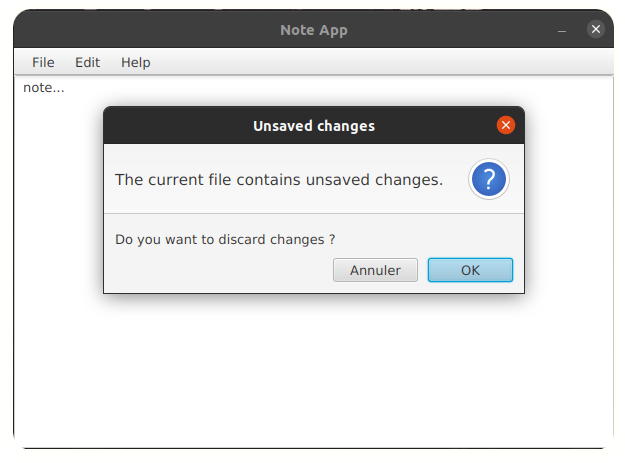

# Note app with Java
> Library: `JavaFX`

> #### After open project, maven install dependencies automatically.
> #### Lookup environment variable `production` in Env.java .

**<center>Note App UI</center>**

# Download Note App
got to release section and download **note-app-`version`.deb**,

### requirement: java 

Set `JAVA_HOME=/your_java_path` in `/etc/environment` <br />
or install jdk with.

```bash
sudo apt install open-jdk-17
```

> Note: if java command exist, and you don't know java path,
> use <br /> ``` which java```


# Install
here, current directory is location of note-app-1.2.deb file

```bash
sudo dpkg -i ./note-app-1.2.deb
```

Finally,  check this in **applications launcher** or use command 
`note-app`

